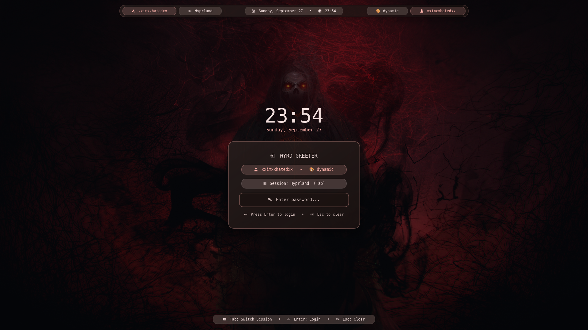

# wyrd-greet

> **Status (`v0.1.0`)**: Early public release. Configuration keys and CLI options may evolve before `1.0`.



A Wayland display manager greeter for `greetd` and a session locker (`ext-session-lock-v1` + PAM) in a single binary. Renders through [`wyrd-engine`](https://github.com/xximxxhatedxx/wyrd-engine), matching the visual style of [`wyrd-shell`](https://github.com/xximxxhatedxx/wyrd-shell) with a floating pill bar and glassmorphic login card.

---

## Features

- **Two modes in one binary**:
  - `--mode=greet` - `greetd` display manager greeter. Discovers installed Wayland and X11 sessions (`/usr/share/wayland-sessions`, `/usr/share/xsessions`), handles authentication via `greetd`'s JSON IPC (`$GREETD_SOCK`), and validates session binaries before displaying them.
  - `--mode=lock` - Session locker using `ext-session-lock-v1` and PAM (`pam_authenticate` + `pam_acct_mgmt`). Invoked by default by `wyrd-idle`.
- **Zero-wrapper `greetd` setup**: When launched on a raw TTY without `WAYLAND_DISPLAY`, `wyrd-greet` bootstraps its own `XDG_RUNTIME_DIR` and starts `cage -s -d` as the Wayland compositor automatically. Your `/etc/greetd/config.toml` stays clean (`command = "wyrd-greet"`).
- **Mode-aware wallpaper & palette lookup**:
  - In `--mode=lock` (active user session), reads `$XDG_RUNTIME_DIR/wyrd/wallpaper.toml` and `~/.local/state/wyrd/wallpaper.toml` first.
  - In `--mode=greet` (`greeter` system user before login), reads `/var/lib/wyrd/wallpaper.toml` and `/etc/wyrd/wallpaper.toml` by default (compatible with encrypted `$HOME` and `systemd-homed` without ACL changes), and falls back to `{pw_dir}/.local/state/wyrd/wallpaper.toml` (resolved from `/etc/passwd`) if POSIX ACLs were explicitly granted.
- **Floating pill bar & multi-monitor**: Hostname, session name, date/time, theme name, and username chips centered independently on each monitor.
- **Lua 5.4 customization**: `~/.config/wyrd/greeter.lua` or `/etc/wyrd/greeter.lua`.
- **Immediate Wayland lock surface commit**: Font scanning and wallpaper decoding happen on background threads so the lock surface commits before compositor watchdogs (`misc:lockdead_screen_delay`) fire.
- **Zeroized secrets**: Password buffers use preallocated `Zeroizing<String>` (`MAX_PASSWORD_BYTES = 256`) and immediately zeroize keystroke strings (`utf8.zeroize()`) to avoid heap reallocations or residual plaintext in memory.

---

## System Dependencies

- **Arch Linux**: `sudo pacman -S --needed rust cargo wayland libxkbcommon fontconfig pam greetd cage`
- **Debian / Ubuntu**: `sudo apt install cargo pkg-config libwayland-dev libxkbcommon-dev libfontconfig1-dev libpam0g-dev greetd cage`
- **Fedora**: `sudo dnf install rust cargo pkgconf-pkg-config wayland-devel libxkbcommon-devel fontconfig-devel pam-devel greetd cage`

---

## Installation

```bash
git clone https://github.com/xximxxhatedxx/wyrd-greet.git
cd wyrd-greet
./install.sh
```

`./install.sh` installs `~/.local/bin/wyrd-greet` (for `--mode=lock`), `/usr/bin/wyrd-greet` (for `greetd`), and copies a safe system snapshot of `greeter.lua` and `wallpaper.toml` to `/etc/wyrd/`.

---

## `greetd` Configuration

`/etc/greetd/config.toml`:
```toml
[terminal]
vt = 1

[default_session]
command = "wyrd-greet"
user = "greeter"
```

### Wallpaper & Palette Synchronization for `greetd`

By default, `./install.sh` copies your current `wallpaper.toml` to `/etc/wyrd/wallpaper.toml` and `/var/lib/wyrd/wallpaper.toml` so `wyrd-greet` works out of the box without modifying `$HOME` permissions.

If you want `greeter` to read live changes directly from `$HOME/.local/state/wyrd/wallpaper.toml`, you can opt in via `./install.sh --grant-acls` (or manually with `setfacl`):

```bash
./install.sh --grant-acls
```

---

## Lua Customization

`~/.config/wyrd/greeter.lua` (or `/etc/wyrd/greeter.lua`). See [`examples/greeter.lua`](examples/greeter.lua) for a full template.

```lua
wyrd.theme("dynamic")  -- or "aetheria", "catppuccin", "tokyo-night", "gruvbox", "nord"

wyrd.config({
    font         = "MesloLGS Nerd Font, JetBrains Mono, sans-serif",
    clock_format = "%H:%M",
    date_format  = "%A, %B %d",
    placeholder  = "󰌋  Enter password...",
    show_top_bar = true,
    backdrop_dim = 0.56,
    card_width   = 430.0,
    card_radius  = 22.0,
})

-- Override any style token
wyrd.style("greet_card", {
    radius  = 28.0,
    padding = { 28.0, 32.0, 28.0, 32.0 },
})
```

---

## Controls

| Key | Action |
| :--- | :--- |
| `Tab` | Cycle through installed sessions |
| `Enter` | Submit password |
| `Esc` | Clear password |
| `Backspace` | Delete last character |

```bash
# Preview the greeter in an existing Wayland session (no greetd needed)
wyrd-greet --mode=greet --dev

# Lock the screen
wyrd-greet --mode=lock
```

---

## Related

- [`wyrd-engine`](https://github.com/xximxxhatedxx/wyrd-engine) - Rendering and scripting engine
- [`wyrd-shell`](https://github.com/xximxxhatedxx/wyrd-shell) - Desktop shell
- [`wyrd-wallpaper`](https://github.com/xximxxhatedxx/wyrd-wallpaper) - Wallpaper daemon that generates the palette used at login

---

## Support

If you find the project useful, you can support it here.

[](https://ko-fi.com/xximxxhatedxx)

---

## License

Dual-licensed under [MIT](LICENSE-MIT) or [Apache-2.0](LICENSE-APACHE).
